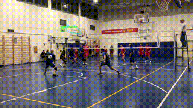
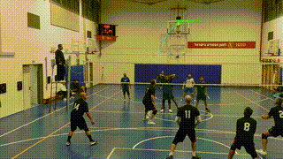
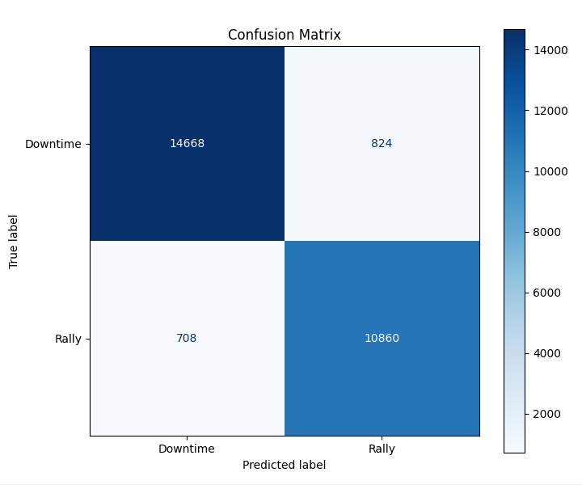
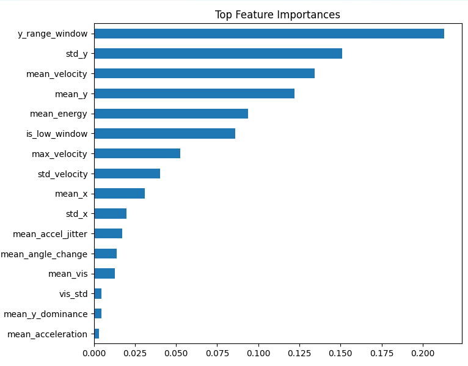

# Automated Volleyball Match Analysis 

This project provides an automated computer vision pipeline for analyzing volleyball match footage. It tracks ball movement to distinguish between active rallies and downtime, facilitating automated highlight extraction and performance analytics.

 


---

## 🛠️ Installation & Setup

This project requires **Python 3.12+**.

### Dependencies

The following libraries are required for the pipeline:

* **Computer Vision:** `ultralytics` (YOLOv11), `opencv-python`
* **Data Analysis:** `numpy`, `pandas`, `scikit-learn`
* **Visualization:** `seaborn`, `tqdm`
* **Utility:** `pathlib`

---

## 📑 Pipeline Stages

### Stage 1: Detect Volleyball in Video

* **Train YOLOv11 Detection Model:** The model was trained using an iterative active learning pipeline involving **SAM3** (Segment Anything Model) to generate ground-truth data from "hard frames."
* **Build Framework for Video Inference:** The framework runs detection on every frame, saving bounding box coordinates to a CSV.
* **Optimization:** The model was converted to **OpenVINO** to speed up inference on local PCs.

### Stage 2: Convert Detections into Tracks

* **Track Assignment:** Each detection is assigned a unique Track ID.
* **Physics-based Prediction:** Future frame assignments are based on physics-based location predictions.
* **Static Object Filtering:** An `is_static` flag prevents moving tracks from incorrectly merging with background objects like sideline balls.

### Stage 3: Clean Tracks

* **Noise Removal:** Low-movement objects and "flickering" detections caused by limbs are filtered out.
* **Continuity:** Prioritizes track continuity over raw confidence scores to maintain detection during high-velocity or blurry frames.

### Stage 4: Feature Extraction

* **Interpolation:** Small gaps in tracks are interpolated for continuity.
* **Movement Metrics:** Calculates **velocity**, **acceleration**, and **y-axis dominance** within a sliding window.

### Stage 5: Predict Rally or Downtime

This stage utilizes a machine learning classifier to categorize match states.

* **Train a Random Forest Model:** A `RandomForestClassifier` from Scikit-learn was trained on labeled data from three different matches.
* **Evaluation:** The model is assessed based on its F1 score and the relative importance of specific features.

<table border="0">
  <tr>
    <td align="center"><b>Predictor F1 Score</b></td>
    <td align="center"><b>Feature Importance</b></td>
  </tr>
  <tr>
    <td>
      
    </td>
    <td>
      
    </td>
  </tr>
</table>

---

### Stage 6: Clean Predictions

* **Temporal Smoothing:** A rolling window is applied to the Random Forest output to remove jitter.
* **Analytics Extraction:** Extracts final stats such as the total number of rallies and average rally duration.

### Stage 7: Visualization

* **Option 1 (Highlights):** Automatically trims the video based on predictions with a 1-second buffer.
* **Option 2 (Data Overlay):** Visualizes bounding boxes, ball "trails," and real-time velocity (pixels per frame).

---


## 🛠️ Installation & Setup

This project uses [uv](https://docs.astral.sh/uv/) for fast, reliable Python package and project management.

### Prerequisites

* **Python 3.12+**
* **uv** (Install via `curl -LsSf https://astral.sh/uv/install.sh | sh` or your preferred method)

### Getting Started

1. **Clone the Repository:**
```bash
git clone https://github.com/mordeLash/volleyball_analytics
cd volleyball_analytics

```


2. **Install Dependencies:**
uv sync

```


---

## 💻 Usage

The pipeline is managed through `main.py` and can be executed as a full process or started from intermediate stages.

### Running the Full Pipeline

To process a video from scratch (Detection → Tracking → Cleaning → Features → Prediction → Visualization):

```bash
uv run main.py --video_path "path/to/match.mp4"

```

### Advanced Usage & Entry Points

You can skip computationally expensive stages (like detection) by providing intermediate CSV files:

* **Start from Tracking:**
```bash
uv run main.py --input_detections "output/table_data/game1_detections.csv"

```


* **Start from Feature Extraction:**
```bash
uv run main.py --input_clean "output/table_data/game1_cleaned.csv"

```


* **Stop Early (e.g., just for cleaning):**
```bash
uv run main.py --video_path "match.mp4" --stop_at cleaning

```

### Configuration Options

* `--rf_model`: Choose which Random Forest version to use (default: `v3`).
* `--device`: Specify `cpu` or `cuda` for YOLOv11 inference (default: `cpu`).
* `--visualize_early`: Generate a video overlay immediately after the current stage.

---


## 🗺️ Roadmap & Future Improvements

* **Handling Variations:** Support for non-30 FPS video models.
* **Calibration:** Add a calibration phase based on ball detections.
* **Feature Refinement:** Implement dual-window extraction (short and long) to better detect serves and high tosses during downtime.
* **Expanded Data:** Add training frames with more diverse ball colors and different camera angles (mid-court, heavy left side).