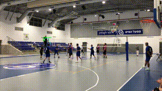

---

# 🏐 Automated Volleyball Match Playtime Extractor

An end-to-end computer vision pipeline designed to automate volleyball match playtime extraction. By tracking ball physics and movement patterns, to distinguish between active play and downtime.

<p align="center">


</p>

## Key Features

* **Automated Play Extraction:** Automatically trims raw match footage into "Rally-only" clips with smart buffers.
* **Physics-Based Tracking:** Uses velocity and direction, to assign tracks to detections  and than uses avg ball behavior(movement and velocity thresholds) to filter out background noise and sideline balls.
* **Active Learning Pipeline:** Detection models trained via an iterative process using **SAM3** (Segment Anything Model) to master "hard frames".
* **Hardware Optimized:** Supports **OpenVINO** for high-speed inference on local CPUs.
* **Dual Interface:** Run via a powerful CLI or a user-friendly GUI, an installer for windows also exist.

---

## 🛠️ Installation & Setup

### For Windows Application (Recommended for Users)

This version is a standalone portable application. It includes all necessary dependencies, including **FFmpeg** and **OpenVINO**, so no separate Python or library installation is required.

1. **Download:** Navigate to the [Releases](https://github.com/mordeLash/volleyball_analytics/releases) page and download the latest `VPE.installer.exe.
2. **Install:** Run the installer and follow the instructions(windows may flag it for being unsafe, because I am not a certified publisher, manually click run anyway).
3. **Run:** After the installation is done, you will have an app called volleyball playtime installer you can run on your pc.
4. **Use:** after selecting a game file and a destination folder, click the run pipeline button(if you don't see it try to expand the window).
5. **Wait** The proccess should take somewhere between 1-3 the time of your video, depending on your pc and if you are using it or not. 

### For Python Installation (For Developers)

This project uses [uv](https://docs.astral.sh/uv/) for high-performance dependency management.

### Prerequisites

* **Python 3.12+**
* **uv** installed (`curl -LsSf https://astral.sh/uv/install.sh | sh`)

### Getting Started

1. **Clone the Repository:**
```bash
git clone https://github.com/mordeLash/volleyball_analytics
cd volleyball_analytics

```


2. **Install Dependencies:**
```bash
uv sync

```


---

## 💻 Usage

### Option 1: Graphical User Interface (GUI)

Perfect for users who want to visualize the process without using the terminal.

```bash
uv run gui.py

```

### Option 2: Command Line Interface (CLI)

The pipeline is managed through `main.py` and supports entry points at any stage.

**Run Full Pipeline:**

```bash
uv run main.py --video_path "path/to/match.mp4"

```

**Advanced Entry Points:**

* **Resume from Tracking:** Skip detection by providing a detections CSV.
```bash
uv run main.py --input_detections "output/table_data/game1_detections.csv"

```


* **Model Selection:** Choose between Random Forest versions (e.g., `v3` or `v4`).
```bash
uv run main.py --video_path "match.mp4" --rf_model "v4"

```


---

## 🔬 How it Works

The project is divided into 7 distinct stages to ensure data integrity:

1. **Detection (YOLOv11):** Frames are processed to find the ball. We use an OpenVINO-optimized YOLOv11 model.
2. **Tracking:** Detections are linked across frames using physics predictions. Static objects (like balls sitting near the net) are filtered out via an `is_static` flag.
3. **Cleaning:** Movement thresholds and "flicker" filters remove false positives caused by player limbs.
4. **Feature Extraction:** Calculates rolling metrics for velocity, acceleration, vertical movement and more.
5. **Classification:** A **Random Forest Classifier** (trained on multi-match data) categorizes frames into "Rally" or "Downtime".
6. **Smoothing:** A temporal rolling window removes jitter, ensuring rallies don't "flicker" off during short ball detection losses.
7. **Visualization:** Generates the final video with data overlays (ball trails and real-time velocity) or just get the playtime of the match.

### Model Performance

The Random Forest model is evaluated using group-based splitting to prevent data leakage between matches.

| Predictor F1 Score | Feature Importance |
| --- | --- |
|  |  |

---

## 🗺️ Roadmap

* **Multi-FPS Support:** Adapt physics calculations for non-30 FPS footage.
* **Auto-Calibration:** Use ball detections to automatically calibrate court dimensions/pixels-to-meters.
* **Service Detection:** Implementation of a dual-window feature extraction to better identify serves and high tosses.
* **Diversified Dataset:** Adding training data from diverse camera angles (mid-court, end-line) and varied ball colors.
* **Continue Analytics Pipeline:** The Ultimate goal of this project is to extract real metrics for the ball movement like height and speed. 

---

## 📄 License

This project is licensed under the MIT License - see the [LICENSE](https://www.google.com/search?q=LICENSE) file for details.